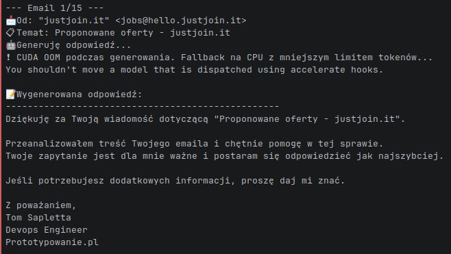

# llmass - LLM Mail Automation System 🤖📧

Inteligentny system automatyzacji poczty email z użyciem AI.



## 📚 Dokumentacja

**Pełna dokumentacja dostępna w katalogu [`docs/`](docs/)**

- [Instalacja](docs/installation.md)
- [Przewodnik szybkiego startu](docs/quickstart.md)
- [Funkcje systemu](docs/features/)
- [Architektura](docs/architecture/)
- [Docker](docs/docker/)
- [Konfiguracja](docs/configuration/)

## 🚀 Funkcje

### Email Organizer Bot
- ✅ Automatyczna kategoryzacja emaili
- ✅ Wykrywanie i przenoszenie spamu
- ✅ Tworzenie nowych folderów dla podobnych wiadomości
- ✅ Konfigurowalne grupowanie (próg podobieństwa, min. rozmiar klastra, min. udział %)
  - Domyślnie: similarity=0.25, min_size=2, min_fraction=0.10
- ✅ Cross-folder spam: automatyczne przenoszenie maili z INBOX podobnych do wiadomości w SPAM/Kosz
- ✅ Ponowne użycie istniejących kategorii (dopasowanie po treści i nadawcach)
- ✅ Automatyczne czyszczenie pustych folderów Category* przy starcie
- ✅ Konfigurowalny TF‑IDF (cechy i stopwords)
- ✅ LOG_LEVEL i tryb DRY‑RUN
- ✅ Obsługa wielu serwerów pocztowych

### Email Responder Bot  
- ✅ Automatyczne generowanie odpowiedzi z użyciem LLM
- ✅ Zapisywanie odpowiedzi jako drafty (nie wysyła automatycznie)
- ✅ Obsługa modeli do 8B parametrów
- ✅ Personalizowane odpowiedzi
- ✅ Filtrowanie automatycznych odpowiedzi

## 📋 Wymagania

- Python 3.8+
- Konto email z dostępem IMAP
- Dla Gmail: hasło aplikacji
- GPU (opcjonalnie, dla szybszego działania LLM)

## 🔧 Instalacja

### Z PyPI (rekomendowane)

```bash
pip install llmass
```

### Z repozytorium

```bash
# Sklonuj repozytorium
git clone https://github.com/dobyemail/llmass.git
cd llmass

# Uruchom skrypt instalacyjny
chmod +x install.sh
./install.sh
# lub użyj Makefile:
make install
```

Lub ręcznie:

```bash
# Utwórz środowisko wirtualne
python3 -m venv venv
source venv/bin/activate

# Zainstaluj zależności
pip install -r requirements.txt

# Zainstaluj pakiet w trybie deweloperskim
pip install -e .
```

## 🐳 Docker Test Environment

### Quick Start

```bash
# Zbuduj i uruchom testy
make test

# Zobacz wyniki
make report        # Otwórz raport HTML
make logs          # Pokaż logi
```

### Architektura Docker

- **MailHog**: Testowy serwer SMTP/IMAP z interfejsem webowym
- **Dovecot**: Serwer IMAP dla przechowywania emaili
- **Email Generator**: Tworzy testowe emaile w różnych kategoriach
- **Email Organizer Bot**: Kategoryzuje i organizuje emaile
- **Email Responder Bot**: Generuje odpowiedzi AI na emaile
- **Test Runner**: Automatyczny pakiet testów z pokryciem kodu

## Architektura systemu (Organizer)

- **[email_organizer.py]**: główny bot organizujący skrzynkę
  - Pobiera emaile z wybranego folderu (`INBOX` domyślnie)
  - Wykrywa spam heurystycznie (`is_spam`) oraz przez podobieństwo do SPAM/Kosz
  - Pomija wiadomości ubogie w treść (`_has_sufficient_text`), by nie fałszować podobieństw
  - Grupuje podobne wiadomości (TF‑IDF + cosine)
  - Zamiast tworzyć nowe foldery, najpierw próbuje dopasować do istniejących kategorii (`_choose_existing_category_folder`)
  - Sanityzuje i tworzy foldery kategorii jako podfoldery `INBOX`
  - Czyści puste `Category*` na starcie
- **[email_responder.py]**: generowanie odpowiedzi z LLM (drafty)
- **[email_generator.py]**: generator przykładowych wiadomości (w tym spam)
- **Dovecot**: IMAP store (test)
- **MailHog**: SMTP + UI (test)

### Przepływ przetwarzania (Organizer)

1) `CONNECT` do IMAP i detekcja delimitera folderów
2) `CLEANUP`: usuń puste `Category*` (opcjonalne)
3) `FETCH` z wybranego folderu (filtr czasu)
4) `SPAM HEURISTICS`: przenieś oczywisty spam
5) `CONTENT CHECK`: jeśli wiadomość ma za mało tekstu → pomiń z kategoryzacji
6) `CROSS-SPAM`: wykryj podobieństwo do SPAM/Kosz i przenieś (konfigurowalne)
7) `CLUSTERING`: grupuj pozostałe
8) `CATEGORY MATCH`: dopasuj klaster do istniejących `INBOX.Category_*`
9) `CREATE/MOVE`: twórz folder (jeśli trzeba) i przenoś maile
10) `EXPUNGE` (wyłączone w DRY‑RUN)

### Dostępne komendy Make

```bash
make help          # Pokaż wszystkie komendy
make build         # Zbuduj obrazy Docker
make up            # Uruchom wszystkie serwisy
make down          # Zatrzymaj wszystkie serwisy
make test          # Uruchom pełny pakiet testów
make test-quick    # Szybki test bez rebuildu
make logs          # Pokaż logi
make shell         # Otwórz shell w kontenerze testowym
make clean         # Wyczyść wszystko
make status        # Pokaż status serwisów
```

### MailHog Web UI

Dostęp do interfejsu MailHog: http://localhost:8025

Funkcje:
- Przeglądanie wszystkich testowych emaili
- Sprawdzanie wykrywania spamu
- Weryfikacja organizacji emaili
- Monitorowanie ruchu SMTP

## 🎯 Użycie

### Instalacja z PyPI

```bash
pip install llmass
```

### Komendy CLI

llmass oferuje zunifikowany interfejs CLI z subkomendami:

#### `llmass generate` - Generowanie testowych emaili

```bash
# Podstawowe użycie (localhost SMTP)
llmass generate --num-emails 50 --spam-ratio 0.2

# Z własnym serwerem SMTP
llmass generate --smtp-host mailhog --smtp-port 1025 --num-emails 100

# Do konkretnego odbiorcy
llmass generate --to test@localhost --num-emails 20
```

#### `llmass clean` - Organizacja i kategoryzacja emaili

```bash
# Podstawowe użycie
llmass clean --email twoj@email.com --password haslo

# Z własnym serwerem IMAP
llmass clean --email twoj@email.com --password haslo --server imap.example.com

# Tryb testowy (bez przenoszenia)
llmass clean --dry-run

# Ograniczenie liczby i zakresu czasu (domyślnie: 100 ostatnich, z 7 dni)
llmass clean --limit 200 --since-days 14
# lub do konkretnej daty (YYYY-MM-DD)
llmass clean --since-date 2025-09-20 --limit 50

# Czułość grupowania (progi konfigurowalne)
llmass clean \
  --similarity-threshold 0.20 \
  --min-cluster-size 2 \
  --min-cluster-fraction 0.05

# Przetwarzanie konkretnego folderu (i opcjonalnie podfolderów)
llmass clean --folder INBOX --include-subfolders --limit 50

# Cross-folder spam (porównanie z SPAM/Kosz)
# Jeśli wiadomość z INBOX jest podobna do maili w SPAM/Kosz (cosine >= CROSS_SPAM_SIMILARITY),
# zostanie automatycznie przeniesiona do SPAM
# (próbkujemy do CROSS_SPAM_SAMPLE_LIMIT wiadomości referencyjnych)
export CROSS_SPAM_SIMILARITY=0.6
export CROSS_SPAM_SAMPLE_LIMIT=200
llmass clean --limit 50 --since-days 7
```

#### `llmass write` - Generowanie odpowiedzi z AI

```bash
# Podstawowe użycie
llmass write --email twoj@email.com --password haslo

# Domyślny model: Qwen/Qwen2.5-7B-Instruct
llmass write --model mistralai/Mistral-7B-Instruct-v0.2

# Przetwarzanie określonego folderu
llmass write --folder "Important" --limit 5

# Ograniczenie liczby i zakresu czasu (domyślnie: 100 ostatnich, z 7 dni)
llmass write --limit 100 --since-days 7
llmass write --limit 50 --since-date 2025-09-20

# Parametry generowania
llmass write --temperature 0.7 --max-tokens 512

# Tryb offline (mock responses, bez LLM)
llmass write --offline --limit 10
```

#### `llmass test` - Uruchom testy

```bash
# Uruchom wszystkie testy
llmass test

# Tryb verbose
llmass test --verbose

# Szybkie testy (bez integracyjnych)
llmass test --quick
```

### Backwards Compatibility

Stare komendy nadal działają dla kompatybilności wstecznej:

```bash
# Zamiast: llmass clean
email-organizer --email twoj@email.com --password haslo

# Zamiast: llmass write
email-responder --email twoj@email.com --password haslo

# Lub bezpośrednio:
python email_organizer.py --email twoj@email.com --password haslo
python email_responder.py --email twoj@email.com --password haslo
```

### Docker + Makefile

```bash
# Domyślnie użyje Qwen/Qwen2.5-7B-Instruct
make respond

# Wymuś inny model
make respond MODEL="mistralai/Mistral-7B-Instruct-v0.2"
```

### Konfiguracja przez .env (fallback)

Skrypty automatycznie ładują zmienne z pliku `.env` (python-dotenv). Priorytet wartości:

1) Parametry CLI (`--email`, `--password`, `--server`, `--smtp`, `--model`, itd.)
2) Zmienne z `.env` (`EMAIL_ADDRESS`, `EMAIL_PASSWORD`, `IMAP_SERVER`, `SMTP_SERVER`, `MODEL_NAME`, `LIMIT`, `TEMPERATURE`, `MAX_TOKENS`, `SMTP_HOST`, ...)
3) Wbudowane wartości domyślne (np. model `Qwen/Qwen2.5-7B-Instruct`, `LIMIT=100`, `SINCE_DAYS=7`, `TEMPERATURE=0.7`, `MAX_TOKENS=500`)

Jeśli nie podasz wymaganych danych logowania w CLI i nie będą one dostępne w `.env`, skrypt zakończy się komunikatem o brakujących zmiennych.

#### Parametry kategoryzacji w `.env`
Możesz globalnie ustawić progi grupowania (używane przez `email_organizer.py`):

```
SIMILARITY_THRESHOLD=0.25
MIN_CLUSTER_SIZE=2
MIN_CLUSTER_FRACTION=0.10

#### Cross-folder spam w `.env`
```
CROSS_SPAM_SIMILARITY=0.6
CROSS_SPAM_SAMPLE_LIMIT=200
```

#### Dopasowanie do istniejących kategorii w `.env`
```
CATEGORY_MATCH_SIMILARITY=0.5
CATEGORY_SENDER_WEIGHT=0.2
CATEGORY_SAMPLE_LIMIT=50
```

#### Sprzątanie pustych kategorii
```
CLEANUP_EMPTY_CATEGORY_FOLDERS=true
```

#### Vectorizer (TF‑IDF) i Stopwords
```
TFIDF_MAX_FEATURES=100
STOPWORDS=none   # none|english
```

#### Progi minimalnej treści (pomijanie maili zbyt ubogich w tekst)
```
CONTENT_MIN_CHARS=40
CONTENT_MIN_TOKENS=6
```

#### Email Responder - podpis i historia konwersacji
```
DRAFTS_FOLDER=INBOX.Drafts            # Folder dla wersji roboczych (auto-detect jeśli brak)
SENDER_NAME=Jan Kowalski               # Imię i nazwisko w podpisie
SENDER_TITLE=Asystent AI               # Tytuł/stanowisko (opcjonalnie)
SENDER_COMPANY=Twoja Firma             # Nazwa firmy (opcjonalnie)
CONVERSATION_HISTORY_LIMIT=3           # Liczba wcześniejszych wiadomości w kontekście (domyślnie: 3)
```

#### Logowanie i tryb testowy
```
LOG_LEVEL=INFO   # DEBUG|INFO|WARNING|ERROR
DRY_RUN=false
```

W Docker Compose możesz je nadpisać na poziomie usług lub w `.env`.

## 🤖 Rekomendowane modele LLM (do 8B)

Domyślnie używamy: **Qwen 2.5 7B Instruct**.

1. **Qwen 2.5 7B Instruct** - Domyślny, bardzo wszechstronny
2. **Mistral 7B Instruct** - Bardzo dobra wydajność
3. **Llama 3.2 8B Instruct** - Dobra jakość odpowiedzi
4. **Gemma 2 9B** - Lekko ponad limit, ale bardzo wydajny

## ⚙️ Konfiguracja dla popularnych dostawców

### Gmail
1. Włącz weryfikację dwuetapową
2. Wygeneruj hasło aplikacji: https://myaccount.google.com/apppasswords
3. Użyj hasła aplikacji zamiast zwykłego hasła

### Outlook/Hotmail
1. Włącz dostęp IMAP w ustawieniach
2. Może wymagać hasła aplikacji

## 🔒 Bezpieczeństwo

- Nigdy nie przechowuj haseł w kodzie
- Użyj zmiennych środowiskowych dla wrażliwych danych:
  ```bash
  export EMAIL_PASSWORD="twoje_haslo"
  python email_organizer.py --email twoj@email.com --password $EMAIL_PASSWORD
  ```
- Rozważ użycie menedżera haseł lub keyring

## 📊 Parametry

### Email Organizer
- `--email`: Adres email (wymagany)
- `--password`: Hasło (wymagany) 
- `--server`: Serwer IMAP (opcjonalny)
- `--dry-run`: Tylko analiza, bez zmian
- `--limit`: Limit emaili do analizy (domyślnie: 100)
- `--since-days`: Okno czasowe w dniach (domyślnie: 7)
- `--since-date`: Najstarsza data w formacie `YYYY-MM-DD`
- `--similarity-threshold`: Próg podobieństwa (0-1) dla grupowania, domyślnie `0.25`
- `--min-cluster-size`: Minimalna liczba emaili w klastrze, domyślnie `2`
- `--min-cluster-fraction`: Minimalny udział wiadomości w klastrze (0-1), domyślnie `0.10`
- `--folder`: Folder do przetworzenia (domyślnie: INBOX)
- `--include-subfolders`: Włącz przetwarzanie podfolderów (eksperymentalne)
- `CROSS_SPAM_SIMILARITY` (ENV): Próg podobieństwa INBOX do SPAM/Kosz (0-1), domyślnie `0.6`
- `CROSS_SPAM_SAMPLE_LIMIT` (ENV): Limit próby maili referencyjnych z SPAM/Kosz, domyślnie `200`
- `CATEGORY_MATCH_SIMILARITY` (ENV): Próg dopasowania klastra do istniejącej kategorii, domyślnie `0.5`
- `CATEGORY_SENDER_WEIGHT` (ENV): Waga zgodności nadawców w dopasowaniu, domyślnie `0.2`
- `CATEGORY_SAMPLE_LIMIT` (ENV): Limit maili referencyjnych z folderów kategorii, domyślnie `50`
- `CLEANUP_EMPTY_CATEGORY_FOLDERS` (ENV): Usuwaj puste Category* przy starcie, domyślnie `true`
- `TFIDF_MAX_FEATURES` (ENV): Liczba cech TF‑IDF, domyślnie `100`
- `STOPWORDS` (ENV): Zbiór stopwords dla TF‑IDF (`none|english`), domyślnie `none`
- `LOG_LEVEL` (ENV): Poziom logowania (`DEBUG|INFO|WARNING|ERROR`), domyślnie `INFO`
- `DRY_RUN` (ENV): Tryb bez skutków ubocznych (`true|false`)

### Email Responder
- `--email`: Adres email (wymagany)
- `--password`: Hasło (wymagany)
- `--model`: Model LLM do użycia
- `--folder`: Folder do przetworzenia (domyślnie: INBOX)
- `--limit`: Limit emaili (domyślnie: 100)
- `--all-emails`: Przetwarzaj wszystkie, nie tylko nieprzeczytane
- `--dry-run`: Nie zapisuj draftów
- `--temperature`: Kreatywność odpowiedzi (0.0-1.0)
- `--max-tokens`: Maksymalna długość odpowiedzi (auto-clamp do 1024 na GPU)
- `--offline`: Tryb offline (mock responses)
- `--since-days`: Okno czasowe w dniach (domyślnie: 7)
- `--since-date`: Najstarsza data w formacie `YYYY-MM-DD`
- `DRAFTS_FOLDER` (ENV): Folder dla draftów, domyślnie `INBOX.Drafts` (auto-detect)
- `SENDER_NAME` (ENV): Imię i nazwisko w podpisie, domyślnie login email
- `SENDER_TITLE` (ENV): Tytuł/stanowisko w podpisie (opcjonalny)
- `SENDER_COMPANY` (ENV): Nazwa firmy w podpisie (opcjonalny)
- `CONVERSATION_HISTORY_LIMIT` (ENV): Liczba wcześniejszych wiadomości w kontekście, domyślnie `3`

## 🧪 Funkcje testowania

### Pokrycie testów
- Walidacja konfiguracji środowiska
- Generowanie emaili (wiele kategorii + spam)
- Łączność SMTP/IMAP
- Dokładność wykrywania spamu
- Kategoryzacja emaili
- Organizacja folderów
- Ładowanie modelu LLM
- Generowanie odpowiedzi
- Tworzenie drafts
- Pełna integracja workflow
- Metryki wydajności

### Raporty z testów
Po uruchomieniu testów znajdziesz raporty w:
- `test-results/report.html` - Raport HTML testów
- `test-results/coverage/index.html` - Pokrycie kodu
- `test-results/junit.xml` - Format JUnit
- `test-results/performance_metrics.json` - Dane wydajności

## 🐛 Rozwiązywanie problemów

### Błąd połączenia
- Sprawdź czy IMAP jest włączony
- Dla Gmail użyj hasła aplikacji
- Sprawdź firewall/antywirus

### Brak pamięci przy ładowaniu modelu
- Użyj mniejszego modelu
- Włącz tryb CPU: usuń CUDA
- Użyj tryb --offline dla testów

### Wolne działanie
- Użyj GPU (NVIDIA z CUDA)
- Zmniejsz --max-tokens
- Użyj mniejszego modelu

### Konflikty portów (Docker)
```bash
# Zmień porty w docker-compose.yml
ports:
  - "8026:8025"  # MailHog UI
  - "1026:1025"  # SMTP
```

### Czysty restart (Docker)
```bash
make clean
make build
make test
```

## 📈 Wydajność

Typowe czasy wykonania testów:
- Konfiguracja środowiska: ~10s
- Generowanie emaili: ~5s
- Organizacja: ~10s
- Generowanie odpowiedzi: ~15s
- Pełny pakiet: ~60s

## 🔒 Uwagi bezpieczeństwa

⚠️ **Środowisko Docker jest tylko do TESTÓW!**
- Używa haseł w postaci zwykłego tekstu
- Brak szyfrowania SSL/TLS
- Mockowe adresy email
- Uproszczona autentykacja

Nigdy nie używaj w produkcji!

## 👨‍💻 Dla Deweloperów

### Lokalna instalacja (dev mode)

```bash
git clone https://github.com/dobyemail/llmail.git
cd llmail
python3 -m venv venv
source venv/bin/activate
pip install -e ".[dev]"
```

### Uruchom testy

```bash
# Przez CLI
llmail test --verbose

# Lub bezpośrednio
pytest -v

# Z pokryciem kodu
pytest --cov=. --cov-report=html
```

### Test instalacji lokalnej

```bash
./test_install.sh
```

### Publikacja na PyPI

```bash
# 1. Zaktualizuj wersję w llmail_cli.py i setup.py
# 2. Zaktualizuj CHANGELOG.md
# 3. Zbuduj paczkę
./publish.sh

# 4. (Opcjonalnie) Test na TestPyPI
python3 -m twine upload --repository testpypi dist/*

# 5. Publikuj na PyPI
python3 -m twine upload dist/*
```

Zobacz [PUBLISHING.md](PUBLISHING.md) dla szczegółowych instrukcji.

### Struktura projektu

```
llmail/
├── llmail_cli.py          # Główny CLI wrapper (llmail clean/write/test)
├── email_organizer.py     # Bot organizujący (llmail clean)
├── email_responder.py     # Bot odpowiadający (llmail write)
├── email_generator.py     # Generator testowych emaili
├── test_suite.py          # Testy jednostkowe i integracyjne
├── setup.py               # Konfiguracja setuptools
├── pyproject.toml         # Nowoczesna konfiguracja buildu
├── MANIFEST.in            # Pliki do pakowania
├── docker_compose.yml     # Środowisko testowe Docker
└── dovecot/               # Konfiguracja Dovecot dla testów
```

### Konwencje kodu

- Python 3.8+ (kompatybilność wsteczna)
- Docstringi dla publicznych funkcji
- Type hints dla nowych kodu
- Black dla formatowania (80-100 znaków)
- Testy dla nowych funkcji

### Zgłaszanie błędów

https://github.com/dobyemail/llmail/issues

## 📝 Licencja

Apache License 2.0

